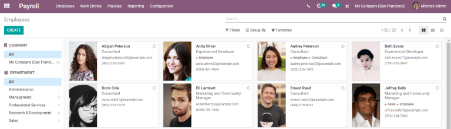
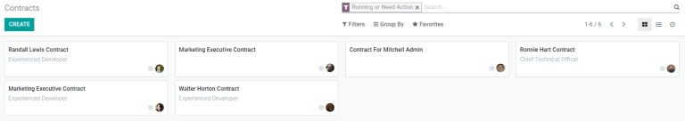
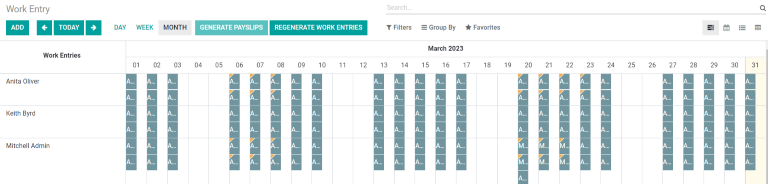
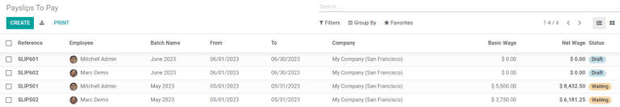
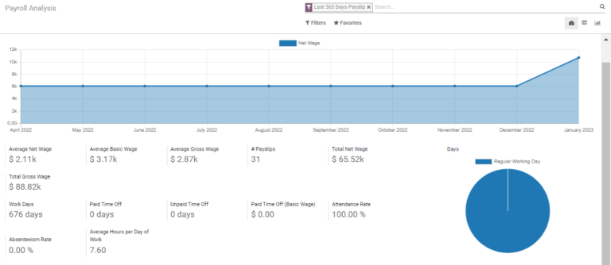

============================
Getting started with Payroll
============================

:guilabel:`Payroll` allows for management of employees, creation of contracts, approval of
timesheets, generation of payslips, and in-depth reporting. The four main components of :guilabel
`Payroll` are :guilabel:`Employees`, :guilabel:`Work Entries`, :guilabel:`Payslips`, and :guilabel:
`Reporting`. All the tools needed to handle payroll accurately, and provide a birds-eye view of both
employees and payments, are handled within these four aspects.

Employees
=========

The list of employees directly overlaps with the :guilabel:`Employees` application, and displays all
the employees of the business, whether full-time, part-time, or contract. The main :guilabel:
`Employees` dashboard displays a summary of each employee’s information in their individual kanban
card. Employees can be sorted by company and/or department from the left side navigation.

Contracts
---------

In order for an employee to be paid, an active contract is required. The :guilabel:`Contracts`
section, housed under :guilabel:`Employees`, displays all the contracts in a grid view. The default
view displays both running contracts and contracts that need action. Expired and canceled contracts
are hidden from the default view.

Work Entries
============

The :guilabel:`Work Entries` dashboard provides a visual overview of all employee's individual time
sheets, with each day split into morning and afternoon shifts. From this page, work entries can be
regenerated if there is an update to schedules, and payslips can be generated.

Conflicts
---------

Any work entry that has a conflict to be resolved is indicated on the main :guilabel:`Work Entry`
dashboard, or by going to the separate :guilabel:`Conflicts` dashboard. A conflict appears for any
request that has not been approved, such as sick time or vacation, or if there are any errors on the
work entry, such as required fields being left blank. Conflicts are required to be resolved before
payslips can be generated.

Payslips
========

:guilabel:`Payslips` consists of three sections; :guilabel:`To Pay`, :guilabel:`All Pay Slips`, and
:guilabel:`Batches`. :guilabel:`To Pay` displays the payslips that have not been generated yet, and
can be created from this dashboard.:guilabel:`All Payslips` displays all payslips regardless of
status, and are organized by month. Both :guilabel:`To Pay` and :guilabel:`All Payslips` display all
the detailed information for each payslip. :guilabel:`Batches` displays all the payslip batches that
have been created, and is where commission payslips are generated.

Reporting
=========

The :guilabel:`Reporting` dashboard is extremely versatile and can display metrics based on the
:guilabel:`Measures` selected to be displayed, such as basic wages, work days, unforeseen absences,
and more. The information can be grouped in a variety of ways  selected in the dashboard. :guilabel:
`Meal Vouchers` provides an overview of  the meal vouchers used by employees, and can be shown by
day, week, month, quarter, or year. :guilabel:`Attachment of Salary` is a report that shows any
deductions or allocations per employee, such as child support payments. Other reports are country
specific, and if the specific report does not apply to the business, a prompt will alert that the
report is not valid. All reports can be inserted into a spreadsheet for further use.

Settings
========

The :guilabel:`Settings` section is where localization settings are configured, including a detailed
view of all  benefits provided to employees. Whether or not payslips should be posted in accounting,
or if SEPA payments are created, is configured here.
