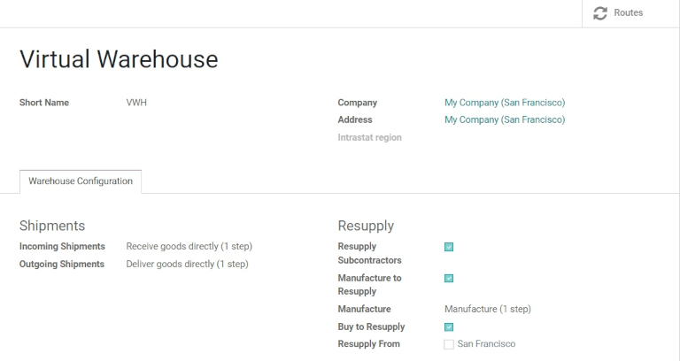
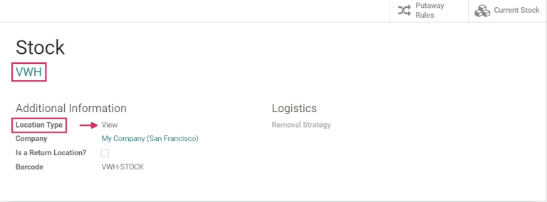
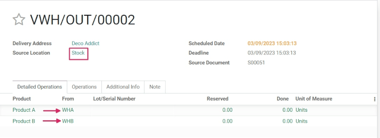
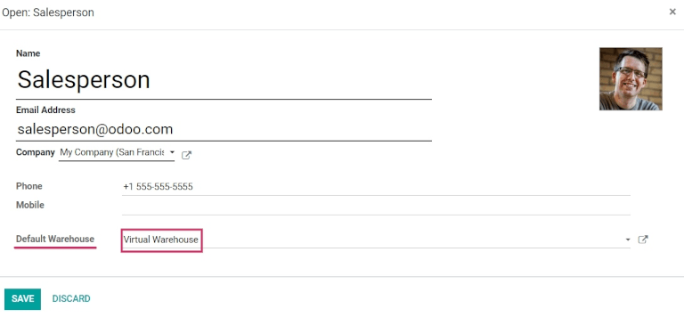

===========================================================
Sell stock from multiple warehouses using virtual locations
===========================================================

While keeping stock and selling inventory from one warehouse might work for smaller companies,
bigger companies might need to keep stock in, or sell from, multiple warehouses in multiple
locations.

In Odoo, sometimes products included in a single sales order might take stock from two (or more)
warehouses. In Odoo, pulling products from multiple warehouses to satisfy sales demands can be done
by using *virtual locations*.

.. note::
   In order to create virtual locations in warehouses and proceed to the following steps,
   the :guilabel:`Storage Locations` and :guilabel:`Multi-Step Routes` features will need to be
   enabled in the :menuselection:`Settings` app.

   To do so, go to :menuselection:`Inventory --> Configuration --> Settings`, scroll down to the
   :guilabel:`Warehouse` section, and click the checkboxes next to those two settings. Then,
   :guilabel:`Save` the changes to finish.

Create and configure a virtual parent location
==============================================

Before creating any virtual stock locations, a new warehouse will need to be created. This new
warehouse will act as a *virtual* warehouse, and will be the *parent* location of other physical
warehouses.

.. spoiler:: Why a "virtual" warehouse?

   Virtual warehouses are great for companies with multiple physical warehouses. This is because
   a situation might arise when one warehouse runs out of stock of a particular product, but
   another warehouse still has stock on-hand. In this case, stock from these two (or more)
   warehouses could be used to fulfill a single sales order.

   The "virtual" warehouse acts as a single aggregator of all the inventory stored in a company's
   physical warehouses, and is used (for traceability purposes) to create a hierarchy of locations
   in Odoo.

Create a new warehouse
----------------------

To create a new warehouse, go to :menuselection:`Inventory --> Configuration --> Warehouses`, and
click :guilabel:`Create`. From here, the warehouse :guilabel:`Name` and :guilabel:`Short Name` can
be changed, and other warehouse details can be changed under the :guilabel:`Warehouse Configuration`
tab.

Under the :guilabel:`Shipments` heading, set the number of steps used to process :guilabel:`Incoming
Shipments` and :guilabel:`Outgoing Shipments` by selecting between the :guilabel:`1 step`,
:guilabel:`2 steps`, and :guilabel:`3 steps` radio buttons.

.. seemore::
   - :doc:`How to choose the right flow to handle receipts?
     </applications/inventory_and_mrp/inventory/management/incoming/handle_receipts>`
   - :doc:`How to choose the right inventory flow to handle delivery orders?
     </applications/inventory_and_mrp/inventory/management/delivery/inventory_flow>

Under the :guilabel:`Resupply` heading, configure the method(s) for how the warehouse resupplies its
inventory:

- :guilabel:`Resupply Subcontractors`: resupply subcontractors with components from this warehouse.
- :guilabel:`Manufacture to Resupply`: when products are manufactured, they can be manufactured in
  this warehouse.
- :guilabel:`Manufacture`: to produce right away, move the components to the production location
  directly and start the manufacturing process; to pick first and then produce, unload the
  components from the stock to input location first, and then transfer it to the production
  location.
- :guilabel:`Buy to Resupply`: when products are bought, they can be delivered to this warehouse.
- :guilabel:`Resupply from`: automatically create routes to resupply this warehouse from another
  chosen warehouse

.. tip::
   :guilabel:`Routes` can be set directly from the :guilabel:`Warehouse Form`, by clicking on the
   :guilabel:`Routes` smart button. Once the warehouse is configured, virtual :guilabel:`Locations`
   can be created.

In order to apply this virtual warehouse as the "parent" location of two "child" location
warehouses, there need to be two warehouses configured with physical stock locations.

.. example::

   | **Parent Warehouse**
   | :guilabel:`Warehouse`: `Virtual Warehouse`
   | :guilabel:`Location`: `VWH`

   | **Child Warehouses**
   | :guilabel:`Warehouses`: `Warehouse A` and `Warehouse B`
   | :guilabel:`Locations`: `WHA/Stock` and `WHB/Stock`

Create a virtual parent location
--------------------------------

.. important::
   In order to take stock from multiple warehouses to fulfill a sales order, there need to be at
   least **two** warehouses acting as "child locations" of the "virtual parent" location warehouse.

To create and edit :guilabel:`Locations`, go to :menuselection:`Inventory --> Configuration -->
Locations`. All :guilabel:`Locations` are listed here, including the stock :guilabel:`Location` of
the virtual warehouse that was created. Click into the stock :guilabel:`Location` for the virtual
warehouse that was previously created. Then, under the :guilabel:`Additional Information` section,
change the :guilabel:`Location Type` from :guilabel:`Internal Location` to :guilabel:`View`.
:guilabel:`Save` the changes.

This identifies this :guilabel:`Location` as a "virtual" :guilabel:`Location`, which is used to
create a hierarchical structure for a warehouse and aggregate its "child" locations.

.. note::
   Products can *not* be stored in a :guilabel:`View` :guilabel:`Location Type`.

Configure physical warehouse locations
--------------------------------------

Navigate back to the :guilabel:`Locations` overview (via the breadcrumbs), and remove any filters
in the :guilabel:`Search Bar`. Then, click into the first physical warehouse :guilabel:`Location`
that was previously created to be a "child" :guilabel:`Location`, and click :guilabel:`Edit`.

Under :guilabel:`Parent Location`, select the virtual :guilabel:`Warehouse` from the drop-down
menu, and :guilabel:`Save` changes. Then, navigate back to the :guilabel:`Locations` overview, and
repeat this step for the second physical :guilabel:`Warehouse` stock :guilabel:`Location`.

Both locations are now "child" locations of the virtual warehouse "parent" location. This allows
stock to be taken from multiple locations to fulfill a sales order if there is not enough stock in
any one location (provided they are both tied to the same virtual warehouse "parent" location).

Example flow: Sell a product from a virtual warehouse
=====================================================

To sell products from multiple warehouses using a virtual "parent" location, there must be at least
*two* products and at least *two* warehouses configured - with at least *one* product in each
warehouse.

To create a new :abbr:`RFQ (Request for Quotation)`, navigate to the :guilabel:`Sales` app, and
click :guilabel:`Create` from the :guilabel:`Quotations` overview. Fill out the information on the
new quotation by adding a :guilabel:`Customer`, and click :guilabel:`Add a product` to add the two
products stored in the two warehouses.

Then, click the :guilabel:`Other Info` tab, and change the :guilabel:`Warehouse` to the virtual
warehouse that was previously created. Once the quotation has been filled out, :guilabel:`Confirm`.

Now that the quotation has been changed to a sales order, click the :guilabel:`Delivery` smart
button. From here, change the :guilabel:`Source Location` to the virtual warehouse that was
previously created.

.. note::
   The :guilabel:`Source Location` and :guilabel:`Warehouse`, under the :guilabel:`Other Info` tab,
   must match in order for the products included in the sales order to be pulled from different
   warehouses.

Finally, if they aren't set already, change the :guilabel:`Locations` under the :guilabel:`From`
column for each product to the "child" locations previously tied to the virtual "parent" location.

Once everything is set, :guilabel:`Validate` the delivery, and invoice for the sales order.

.. tip::
   To use a virtual "parent" location as the default warehouse for sales orders, each salesperson
   can have the virtual warehouse assigned to them from the drop-down menu next to
   :guilabel:`Default Warehouse` on their employee form.

