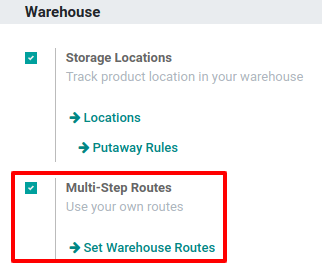
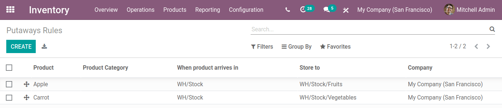
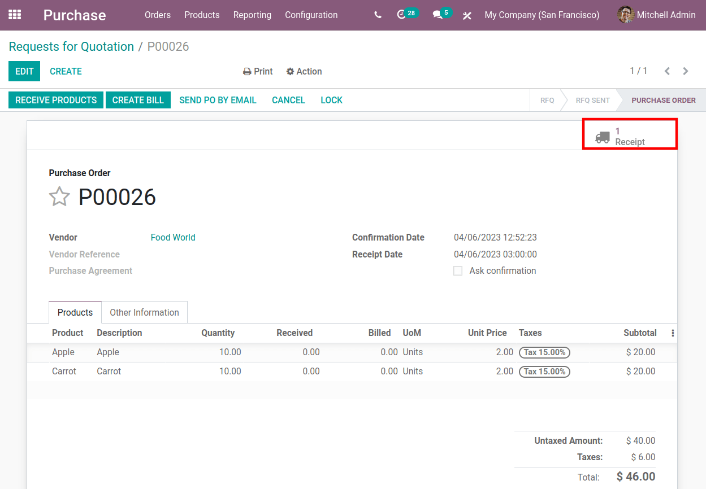
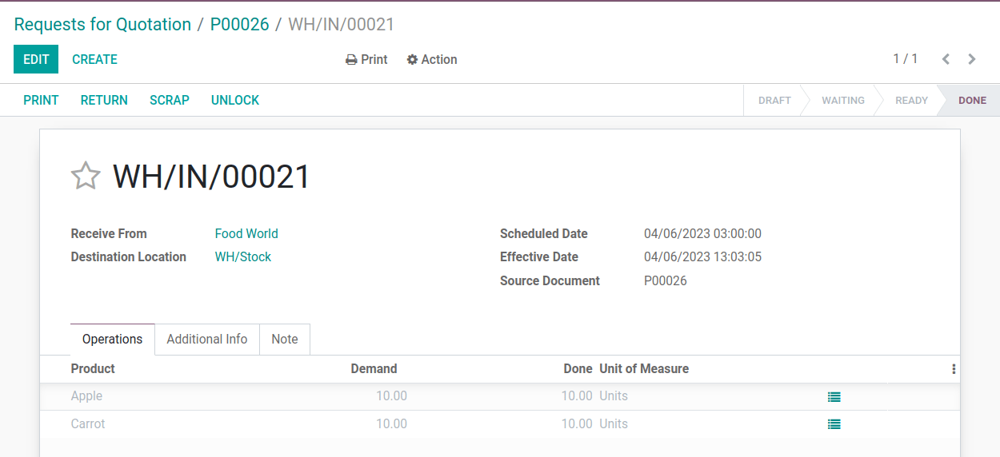
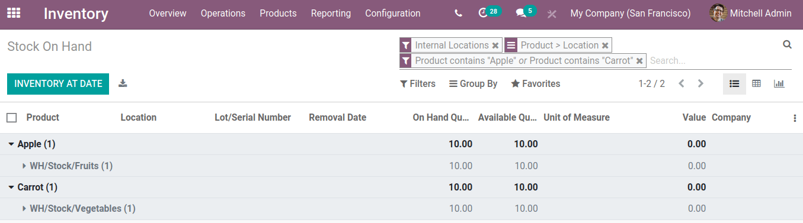

=============
Putaway Rules
=============

Putaway is the process of receiving shipments and routing the products in them to the appropriate
storage locations. This process can be accomplished seamlessly in Odoo using *putaway rules*.

The rules detail how products move into and throughout specified locations in the warehouse.
They are triggered by the arrival of shipments in a certain location. The automatically generated
rules coordinate efficient inter-warehouse transfers.

If, for example, a warehouse contains multiple volatile substances that should not come into
contact, it is crucial that these substances not be stored in close proximity to one another. Using
putaway rules, it is possible to ensure that such products are stored in different locations.

.. seealso::
   - :ref:`Routes-- how products move<inventory/routes/use_routes/push>`
   - :ref:`Warehouse locations<inventory/warehouse_location/definition>`

Configuration
=============

Begin by navigating to :menuselection:`Inventory --> Configuration --> Settings`, then activate the
:guilabel:`Multi-Step Routes` checkbox under the :guilabel:`Warehouse` heading. By doing so, the
:guilabel:`Storage Locations` setting is automatically enabled as well. Finally, click
:guilabel:`Save`.

Create a putaway rule
=====================

To manage where specific products are routed for storage, navigate to :menuselection:`Inventory -->
Configuration --> Putaway Rules`. Then, click on :guilabel:`Create` to configure a new putaway rule.
Choose the :guilabel:`Product` and/or :guilabel:`Product Category` that the rule will affect. Set
:guilabel:`When product arrives in` as the :ref:`location<inventory/warehouse_location/definition>`
where the rule will be triggered and :guilabel:`Store to` as the location where products affected by
the rule will be stored. Finally, click :guilabel:`Save`.

.. note::
  It is also possible to create and manage putaway rules for a single product by going to the
  product page and clicking the :guilabel:`Putaway Rules` smart button at the top of the page. If
  the button isn't there at first glance, select the :guilabel:`More` button at the top right to
  view additional configuration options.

Once a putaway rule has been configured, the product it specifies will be automatically routed to
the :guilabel:`Store to` location upon arriving in the :guilabel:`When product arrives in` location.
The summary of internal product movements can be viewed by selecting :menuselection:`Reporting -->
Product Moves` and enabling the :guilabel:`Internal` search filter on the :guilabel:`Filters`
dropdown under the :guilabel:`search bar` at the top of the page.

After configuring the putaway rules for apples and carrots, see the internal stock moves by
first buying products from a vendor using a :ref:`purchase order<inventory/purchase/vendor bills>`.

In the :guilabel:`Purchase` app, create a :guilabel:`Request for Quotation` in the top of the menu,
add the products, and select :guilabel:`Confirm` to send the order to the vendor.

Receive the incoming shipment by selecting :menuselection:`Receive products --> Validate`.

Verify stock moves
==================

Confirm whether the products have been moved to the correct location, go to the
:guilabel:`Inventory` app, and in the upper menu, navigate to :menuselection:`Reporting -->
Inventory Report` to view the all products in stock. By default, the products are grouped by
location. Select the record for a specific product to view the location where the products are
stored.

In the image below, the apples and carrots are indeed found in the locations detailed by the putaway
rules.

