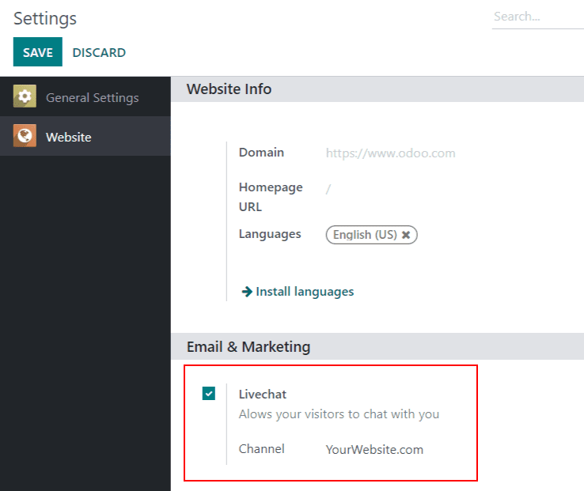
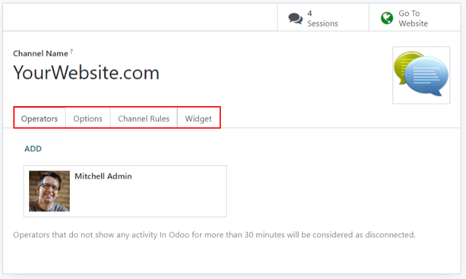
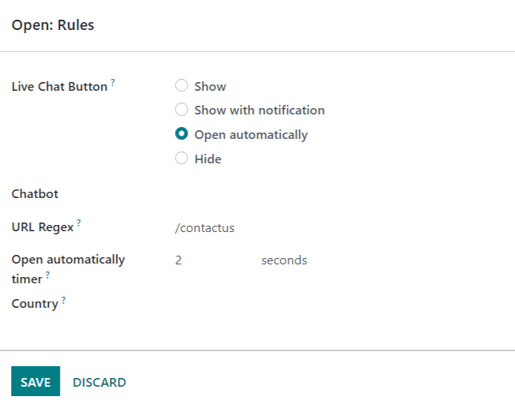
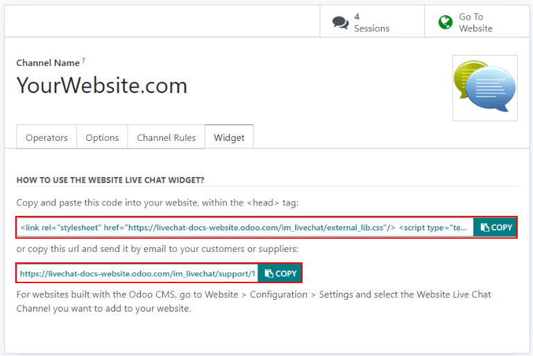
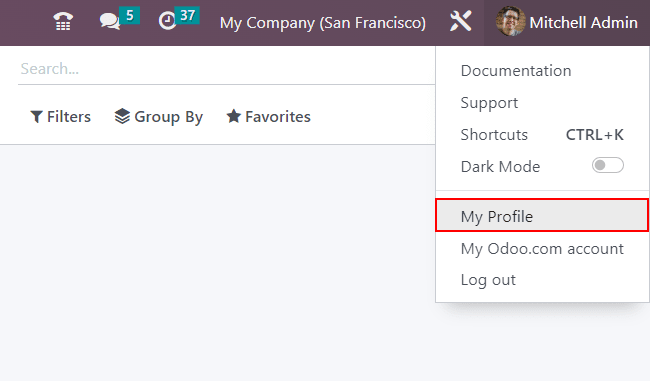
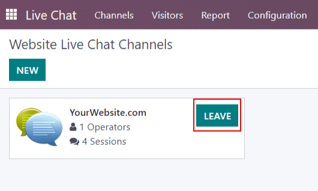
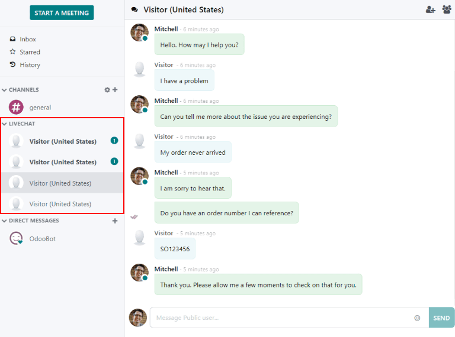
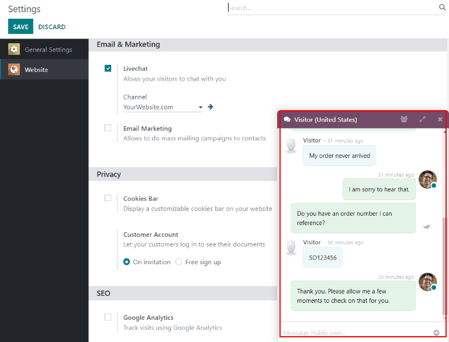

==========================
Get Started with Live Chat
==========================

Odoo *Live Chat* allows users to communicate with website visitors in real time. Potential leads
can be qualified for their sales potential, support questions can be answered quickly, and issues
can be directed to the appropriate team for further investigation or follow up. *Live Chat* also
provides the opportunity for instant feedback from customers.

Enabling live chat
==================

In order to enable :guilabel:`Live Chat`, the application needs to be installed. This can be done
in one of two ways.

- Go to :menuselection:`Dashboard --> Apps --> Live Chat` and click :guilabel:`Install`.

- In the :guilabel:`Website` application, go to :menuselection:`Configuration --> Settings`, scroll
  to the :guilabel:`Email & Marketing` section, and check the box next to :guilabel:`Live Chat`.
  :guilabel:`Save` any changes.

A :guilabel:`Live Chat Channel` will be created by default and automatically selected in the
drop-down.

Create a new live chat channel
==============================

To create a new :guilabel:`Live Chat Channel`, go to :menuselection:`Dashboard --> Live Chat -->
New`. Enter the name of the new channel in the :guilabel:`Channel Name` field.

To configure the remaining tabs, follow the steps below.

Operators
---------

*Operators* are the users who will respond to live chat requests from customers. The user who
originally created the live chat channel will be added as an operator by default.

To add additional users, navigate and click on the :guilabel:`Live Chat Channel` from the
:guilabel:`Website Live Chat Channels` dashboard, and on the :guilabel:`Operators` tab, click
:guilabel:`ADD`.

Then, click the check box next to the users to be added, and click :guilabel:`SELECT`.
:guilabel:`New` operators can be created and added to the list, as well, by filling out the
:guilabel:`Create Operators` form and then clicking :guilabel:`SAVE & CLOSE` (or :guilabel:`SAVE &
NEW` for multiple record creations).

As well, current operators can be edited or removed by clicking on their respective boxes in the
:guilabel:`Operators` tab, and then adjusting their form values, or by using one of the form
buttons located at the bottom of the form, such as :guilabel:`REMOVE`.

Options
-------

The :guilabel:`Options` tab contains the visual and text settings for the live chat window.

Change the text in the :guilabel:`Text of the Button` field to update the greeting displayed in the
text bubble when the live chat button appears on the website.

Edit the :guilabel:`Welcome Message` to change the message a visitor sees when they open the chat
window. This message will appear as though it is sent by a live chat operator, and should be an
invitation to continue the conversation.

Edit the :guilabel:`Chat Input Placeholder` to change the text that appears in the box where
visitors will type their replies.

Change the :guilabel:`Livechat Button Color` and and the :guilabel:`Channel Header Color` by
clicking a color bubble to open the color selection window. Click the refresh icon to the right of
the color bubbles to reset the colors to the default selection.

.. tip::
   Color selection, for the button or header, can be made manually, or through RGB, HSL or HEX code
   selection. Different options will be available, depending on your operating system.

Channel rules
-------------

The :guilabel:`Channel Rules` tab determines when the live chat window opens on the website by
logic of when a :guilabel:`URL Regex` action is triggered (e.g., a page visit).

Edit existing rules, or create a new one by clicking :guilabel:`Add a line`, and fill out the
pop-up form details based on how the rule should apply.

If a :guilabel:`Chatbot` will be included on this channel, select it from the dropdown. If the
chatbot will only be active when no operators are available, check the box labeled
:guilabel:`Enabled only if no operator`.

Add the URL for the pages this channel will be applied to in the :guilabel:`URL Regex` field. If
this channel will only be available to users in specific countries, add them to the
:guilabel:`Country` field. If this field is left blank, the channel will be available to all site
visitors.

.. note::
   In order to track the geographical location of visitors, :guilabel:`GeoIP` must be installed on
   the database. While this feature is installed by default on :guilabel:`Odoo Online`,
   :guilabel:`On-Premise` databases will require additional :doc:`setup steps
   </applications/websites/website/publish/on-premise_geo-ip-installation>`.

Widget
------

The :guilabel:`Widget` tab on the live chat channel form offers an embeddable website widget, or a
shortcode for instant customer/supplier access to a live chat window.

The live chat :guilabel:`Widget` can be added to websites created through Odoo by navigating to
the :menuselection:`Website --> Configuration --> Settings`. Then scroll to the :guilabel:`Live
Chat` section, and select the channel to add to the site. Click :guilabel:`Save` to apply.

To add the widget to a website created on a third-party platform, click :guilabel:`COPY` and paste
the code into the `<head>` tag on the site.

Likewise, to send a live chat session to a customer or supplier, click the second :guilabel:`COPY`
button which contains a link to join directly.

Participate in live chat
========================

As explained above, *operators* are the users who will respond to live chat requests from
customers. The information below outlines the necessary steps for operators participating in
live chat conversations on an *Odoo* database.

Set an online chat name
-----------------------

Before participating in a live chat, operators should update their :guilabel:`Online Chat Name`.
This is the name that will be displayed to site visitors in the live chat conversation.

To update the :guilabel:`Online Chat Name`, click on the user name in the upper right corner of any
page in the database. Select :guilabel:`My Profile`. Scroll to the :guilabel:`Online Chat Name`
field and enter the preferred name.

If an :guilabel:`Online Chat Name` is not set, the name displayed will default to the
:guilabel:`User Name`.

.. example::
   A user has their full name as their :guilabel:`User Name`, but they do not want to include their
   last name when participating in live chat. They would then set their :guilabel:`Online Chat
   Name` to include only their first name.

  .. image:: get_started/live-chat-online-chat-name.png
     :align: center
     :alt: View of user profile in Odoo, emphasizing the Online Chat name field.

Join or leave a channel
-----------------------

To join a live chat channel, go to the :menuselection:`Live Chat` app and click the
:guilabel:`JOIN` button on the kanban card for the appropriate channel. Any channel where the user
is currently active will show a :guilabel:`LEAVE` button. Click this button to disconnect from the
channel.

.. important::
   Operators that do not show any activity In Odoo for more than thirty minutes will be considered
   as disconnected.

Manage live chat requests
-------------------------

Conversations initiated by site visitors appear as direct messages in the :guilabel:`Discuss`
application. New conversations will appear in bold.

When a user is added as an operator in a live chat channel, they will be able to receive chats from
website visitors wherever they are in the database. Chat windows will open in the bottom right
corner of the screen.

.. seealso::
   - :doc:`Get Started with Discuss </applications/productivity/discuss/overview/get_started>`
   - :doc:`ratings`
   - :doc:`responses`
