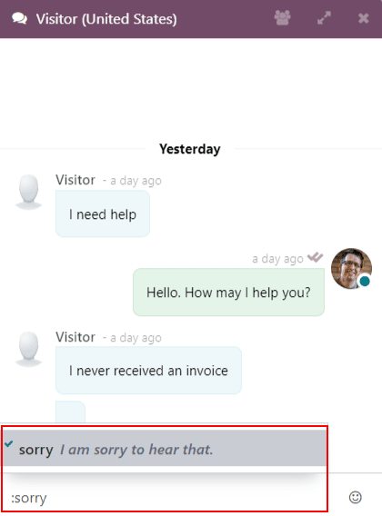

=============================
Commands and canned responses
=============================

*Live Chat* commands allow users to perform specific actions both inside the chat window, and
through other *Odoo* applications. *Canned Responses* are customized substitutions that allow users
to replace shortcut entries in place of longer, well-thought out responses to some of the most
common questions and comments.

Both *Commands* and *Canned Responses* save time, and allow users to maintain a level of
consistency throughout their conversations.

Execute a command
=================

*Commands* are keywords that triggers pre-configured actions. More information about each available
command can be found below.

.. tabs::

   .. tab:: `/help`

      The `/help` command displays an informative message that includes the potential entry types
      an operator can make.

      .. image:: responses/live-chat-responses-help.png
         :align: center
         :alt: View of the message generated from using the /help command in Odoo Live Chat.

   .. tab:: `/helpdesk`

      The `/helpdesk` command uses the conversation to create a :guilabel:`Helpdesk Ticket`. The
      transcript from the conversation will be added to the new ticket, under the
      :guilabel:`Description` tab.

      .. image:: responses/live-chat-helpdesk.png
         :align: center
         :alt: View of the results from a helpdesk search in a Live Chat conversation.

      See :doc:`Start receiving tickets
      </applications/services/helpdesk/overview/receiving_tickets>` for more information.

   .. tab:: `/helpdesk_search`

      The `/helpdesk_search` command allows an operator to search through :guilabel:`Helpdesk`
      tickets by ticket number or keyword.
      If a related ticket is found, a link will be generated in the conversation window.

      .. image:: responses/live-chat-helpdesk-search.png
         :align: center
         :alt: View of the results from a helpdesk search in a Live Chat conversation.

   .. tab:: `/history`

      The `/history` command generates a list of the most recent pages the visitor has viewed on
      the website (up to 15).

      .. image:: responses/live-chat-responses-history.png
         :align: center
         :alt: View of the results from a /history command in a Live Chat conversation.

   .. tab:: `/lead`

      This command creates a :guilabel:`Lead` in the :guilabel:`CRM` application. After typing
      `/lead`, create a title for this new lead, then press `Enter`. The transcript of the
      conversation is added to the :guilabel:`Internal Notes` tab of the lead form. On the
      :guilabel:`Extra Information` tab of the lead form, the :guilabel:`Source` will be listed as
      :guilabel:`Livechat`.

      .. image:: responses/live-chat-responses-lead.png
         :align: center
         :alt: View of the results from a /lead command in a Live Chat conversation.

   .. tab:: `/leave`

      The `/leave` command lets the *operator* leave the conversation channel.

.. important::
   - The `/helpdesk` and `/helpdesk_search` commands can only be used if the :guilabel:`Helpdesk`
     app has been installed, and :guilabel:`Live Chat` has been activated on a :guilabel:`Helpdesk
     Team`. To activate :guilabel:`Live Chat`, go to :menuselection:`Helpdesk --> Configuration -->
     Teams`, and select a team. Scroll to the :guilabel:`Channels` section and check the box
     labeled :guilabel:`Live Chat`.
   - The `/lead` command can only be used if the :guilabel:`CRM` app has been installed.

.. tip::
   To access the :guilabel:`ticket` or :guilabel:`lead` created from the chat, click on the link.

  .. image:: responses/live-chat-responses-ticket-link.png
     :align: center
     :alt: View of the chat window with a helpdesk ticket created in Odoo Live Chat.

.. seealso::
   - :doc:`/applications/sales/crm/acquire_leads`
   - :doc:`/applications/services/helpdesk/overview/getting_started`

Canned responses
================

*Canned responses* are customizable inputs where a shortcut stands in for a longer response. An
operator will enter the :guilabel:`Shortcut`, and it will be replaced by the
:guilabel:`Substitution`.

Create new canned responses
---------------------------

To create a new :guilabel:`Canned Response`, go to :menuselection:`Live Chat --> Configuration -->
Canned Responses --> New`. Choose a :guilabel:`Shortcut`. Enter the :guilabel:`Substitution`
message. This will be the message that is sent to the recipients. Click :guilabel:`Save`.

.. tip::
  Try to connect the :guilabel:`Shortcut` to the topic of the :guilabel:`Substitution`. The easier
  it is for the *operators* to remember, the easier it will be to use the *canned responses* in
  conversations.

Insert a canned response in a conversation
------------------------------------------

To use a *Canned response* during a live chat conversation, type a colon (`:`)  into the chat
window, followed by the shortcut.

.. example::
   An operator is talking to a site visitor. As soon as they type `:` they would see a list of
   available responses. They can manually select one from the list, or continue to type. If they
   want to use the the canned response *'I am sorry to hear that.'*, they would type `:sorry`.

.. tip::
   Typing `:` into a chat window on its own will generate a list of available canned responses.
   Responses can be manually selected from the list, in addition to the use of shortcuts.

   .. image:: responses/live-chat-response-list.png
     :align: center
     :alt: View of a chat window and the list of available canned responses.
